2024-08-09 23:06

Status: #baby

Tags: [[Book]]

# Mastering STM32

## Chapter 1: STM Portfolio
### Cortex-?
- Cortex-A
	- stands for Application
	- provides range of solutions for devices undertaking complex computing tasks such as an OS
- Cortex-M
	- stands for eMbedded
- Cortex-R
	- stands for Real-Time
### Core Registers
- Like all RISC architectures, Cortex-M processors are load/store machines
	- only performs operations on CPU registers except for load and store instructions
	- moving data between registers and memory locations
### Memory Mapping
- Fixed Memory Address Space
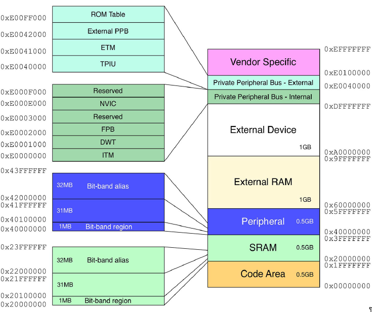
- ARM defines a standardized memory address space common to all Cortex-M cores.
- The address space is 4GB wide
### Code Area
- First 512MB of the address space is the code area which is further divided into more subregions
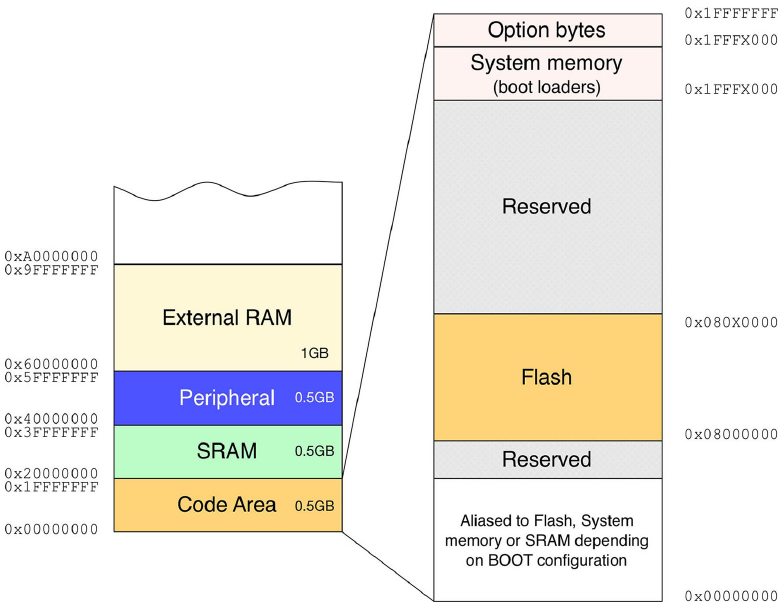
- All M processors map the code area starting at address 0.
	- All STM32 devices are bound to 0x0800_0000 for Internal Flash and so on and so forth
- This area also includes:
	- pointer to the beginning of the stack (usually in SRAM)
	- pointer to the vector table
- Although it starts a 0x0, the Flash address is aliased so 0x0000_0000 and 0x0800_0000 both point to the starting address of the internal Flash
- The system memory at 0x1FFF_X000 is the ROM region reserved for bootloaders
- The option bytes region contains a series of bit flags which can used to configure parts of the MCU such as flash read protection, hardware watchdog, bootmode
### SRAM
- Starting at 0x2000_0000 (size depends on chip)
---
## Chapter 6: GPIO Management
### Buses
- Every STM32 peripheral is interconnected to the MCU core by several orders of buses
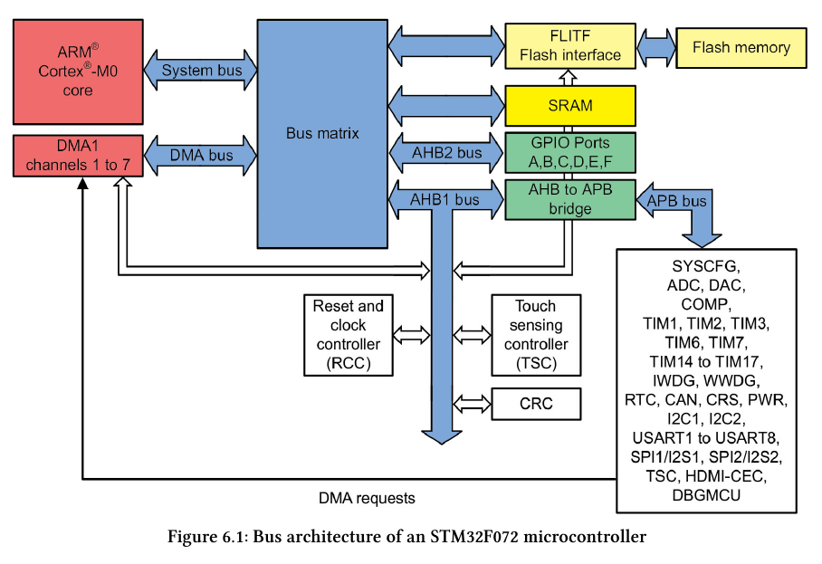
- The Advanced Peripheral Bus (APB) connects the peripherals to the AHB to APB Bridge
- The Advanced High-performance Bus (AHB) connects to the bus matrix as well as the DMA
- The System Bus connects the core to the bus matrix whihc manages the arbitration between the core and the DMA.
	- The core and the DMA act as masters
### Example Peripheral Memory Region
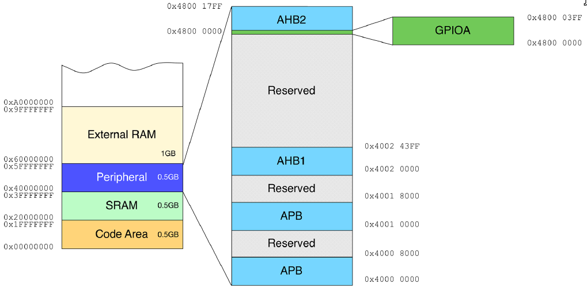
### Example Enabling of the PA5 Pin
- Configure the MODER register so that bits[11:0] are 01 (gen. purpose output mode)
- Pull the pin high by setting the bit[5] inside the Output Data Register (ODR)
```c
// Register pointers
volatile uint32_t* GPIOA_MODER = (uint32_t*)0x48000000;
volatile uint32_t* GPIOA_ODR = (uint32_t*)(0x48000000 + 0x14);

// Ensure the peripheral is enabled and connected to the AHB1 Bus
__HAL_RCC_GPIOA_CLK_ENABLE();

// Write to the registers
*GPIOA_MODER = *GPIOA_MODER | 0x400; // Sets MODER[11:10] = 01
*GPIOA_ODER = *GPIOA_ODR | 0x20; // Sets ODR[5] = 0x1
```

### HAL
- The Hardware Abstraction Language provides a general and more user-friendly way to configure the peripheral without forcing the programmer to know to configure in detail
### HAL GPIO Configuration
```c
HAL_GPIO_Init(GPIO_TypeDef *GPIOx, GPIO_InitTypeDef *GPIO_Init)
```

```c
typedef struct {
	uint32_t Pin;
	uint32_t Mode;
	uint32_t Pull;
	uint32_t Speed;
	uint32_t Alternate;
} GPIO_InitTypeDef;
```
Pin:
- number starting from 0 of the pin(s) to be configured
- PA5 assumes the value GPIO_PIN_5 (GPIO_PIN_x is a bitmask)
- We can configure several pins at once using bitwise OR
Mode:
- operating mode that assumes one of the values in the below table
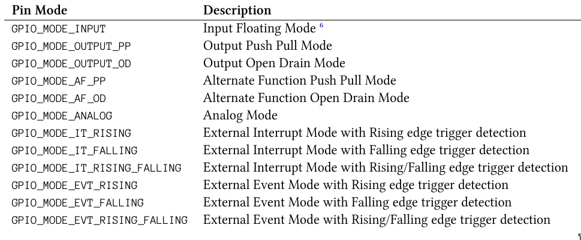
Pull
- specifies the Pull-up or Pull-down activation for the selected pin(s)
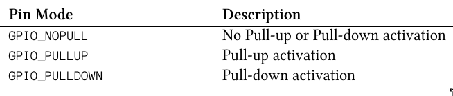
### HAL GPIO Driving
```c
// Read status of an I/O
GPIO_PinState HAL_GPIO_ReadPin( GPIO_TypeDef* GPIOx, uint16_t GPIO_Pin );

// Change the I/O state
void HAL_GPIO_WritePin( GPIO_TypeDef* GPIOx, uint16_t GPIO_Pin, GPIO_PinState PinState );

// Invert the I/O state
void HAL_GPIO_TogglePin( GPIO_TypeDef* GPIOx, uint16_t GPIO_Pin );

// Lock the Pin Configuration
HAL_StatusTypeDef HAL_GPIO_LockPin( GPIO_TypeDef* GPIOx, uint16_t GPIO_Pin );

// Reset a pin to default
void HAL_GPIO_DeInit( GPIO_TypeDef* GPIOx, uint32_t GPIO_Pin );
// Great for if we no longer need a peripheral and avoiding waste of power
```
Pin State:
1. **GPIO_PIN_RESET**: This sets the GPIO pin to a low state (logic 0).
    - Example: `HAL_GPIO_WritePin(GPIOC, GPIO_PIN_13, GPIO_PIN_RESET);`
    - This will drive the pin to 0V (ground).

2. **GPIO_PIN_SET**: This sets the GPIO pin to a high state (logic 1).
    - Example: `HAL_GPIO_WritePin(GPIOC, GPIO_PIN_13, GPIO_PIN_SET);`
    - This will drive the pin to the supply voltage (3.3V or 5V, depending on the microcontroller's operating voltage).


---
## Chapter 7: Interrupt Management
### Interrupt Overview
- An Interrupt is an asynchronous event that causes stopping the execution of the current code on a priority basis
- The code that services the interrupt is the Interrupt Service Routine (ISR)
- Hardware is aware about interrupts and is responsible for the saving the current execution context (stack frame, program counter, etc ) before switching to the ISR
-  Interrupts originate by hardware also known as `Interrupt Requests` or `IRQ`, `exceptions` originate by software
- Cortex-M processors provide a unit dedicated to exceptions management called the `Nested Vectored Interrupt Controller` or NVIC.
### Nested Vectored Interrupt Controller (NVIC)
- Dedicated hardware unit responsible for exceptions handling
- I/O which generate interrupts external to the MCU are handled with a dedicated programmable controller called the `External Interrupt/Event Controller` or EXTI
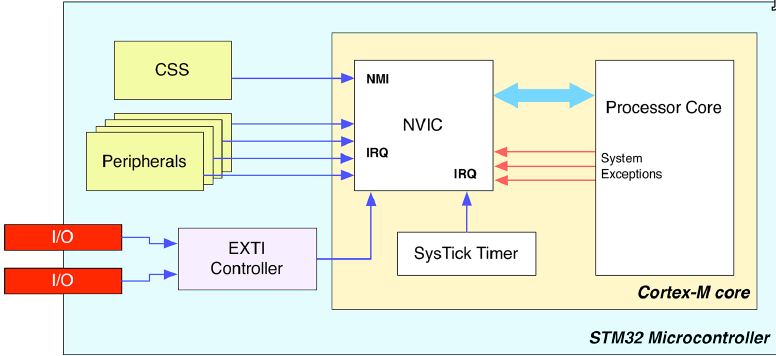
- The processor knows where to locate these routines thanks to an indirect table known as the `Vector Table` which contains the addresses in memory of ISRs
- Table of exception types:
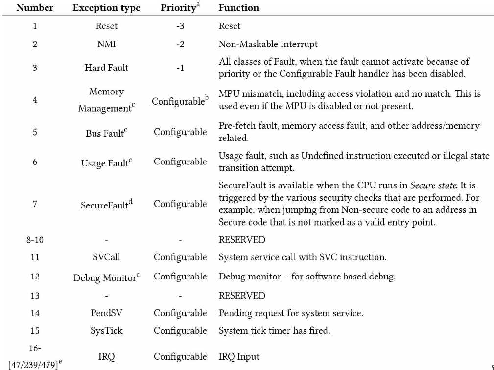
- The vector table starts at address 0x0000_0000 in memory, i.e. the starting address of flash at 0x0800_0000.
### Enabling/Disabling Interrupts
- When a STM32 boots up, only Reset, NMI, and Hard Fault exceptions are enabled by default.
```c
void HAL_NVIC_EnableIRQ( IRQn_Type IRQn );
void HAL_NVIC_DisableIRQ( IRQn_Type IRQn );
```
- where IRQn_Type is an enumeration of all exceptions and interrupts defined for that specific MCU
- These interrupts will be defined in something like *Drivers/CMSIS/Device/ST/STM32XXxx/Include/stm32XXxx.h*
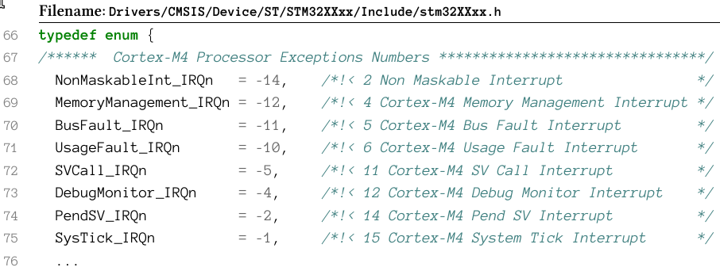
### Important to Note
- Only one PxY pin can be a source of interrupt
	- We cannot define both PA0 and PB0 as input interrupt pins
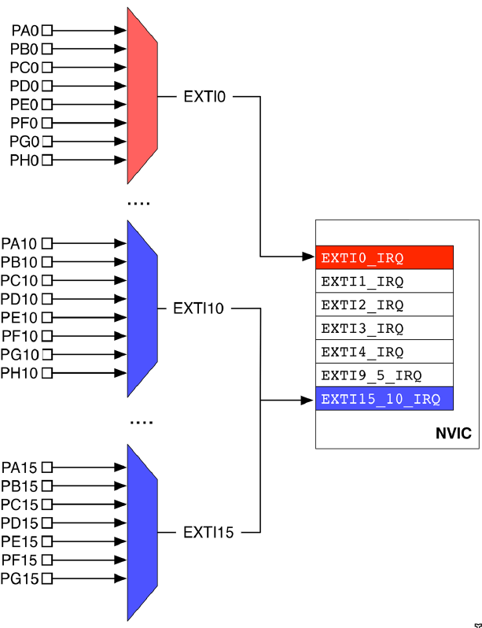
### Toggling an LED using Interrupts from book
```c
int main(void)
{
	GPIO_InitTypeDef GPIO_InitStruct = {0};
	HAL_Init();
	SystemClock_Config();

	// GPIOA and GPIOC
	__HAL_RCC_GPIOA_CLK_ENABLE();
	__HAL_RCC_GPIOC_CLK_ENABLE();

	// Configuring the button at PC13
	GPIO_InitStruct.Pin = GPIO_PIN_13;
	GPIO_InitStruct.Mode = GPIO_MODE_IT_RISING;
	GPIO_InitStruct.Pull = GPIO_PULLDOWN;
	HAL_GPIO_Init(GPIOC, &GPIO_InitStruct);

	// Configuring the LED at PA5
	GPIO_InitStruct.Pin = GPIO_PIN_5;
	GPIO_InitStruct.Mode = GPIO_MODE_OUTPUT_PP;
	GPIO_InitStruct.Pull = GPIO_NOPULL;
	GPIO_InitStruct.Speed = GPIO_SPEED_FREQ_LOW;
	HAL_GPIO_Init(GPIOA, &GPIO_InitStruct);

	// Configure the LED Output Level
	HAL_GPIO_WritePin(GPIOA, GPIO_PIN_5, GPIO_PIN_RESET);

	// Enable the EXTI Interrupt for the button
	HAL_NVIC_EnableIRQ( EXTI15_10_IRQn );
}

void EXTI15_10_IRQHandler(void)
{
	HAL_GPIO_EXTI_IRQHandler(GPIO_PIN_13);
}

void HAL_GPIO_EXTI_Callback(uint16_t GPIO_Pin)
{
	if(GPIO_Pin == GPIO_PIN_13)
		HAL_GPIO_WritePin(GPIOA, GPIO_PIN_5, SET);
	else if(GPIO_Pin == GPIO_PIN_12)
		HAL_GPIO_WritePin(GPIOA, GPIO_PIN_5, RESET);
}


```
### Toggling an LED using Interrupts actual
```c
static void MX_GPIO_Init(void)
{
	GPIO_InitTypeDef GPIO_InitStruct = {0};
	/* USER CODE BEGIN MX_GPIO_Init_1 */
	/* USER CODE END MX_GPIO_Init_1 */

	/* GPIO Ports Clock Enable */
	__HAL_RCC_GPIOC_CLK_ENABLE();
	__HAL_RCC_GPIOA_CLK_ENABLE();

	/* Configure GPIO pin Output Level, its a sink LED to its active low */
	HAL_GPIO_WritePin( GPIOC, GPIO_PIN_13, GPIO_PIN_RESET);

	/*Configure GPIO pin : LED_Pin PC13 */
	GPIO_InitStruct.Pin = GPIO_PIN_13;
	GPIO_InitStruct.Mode = GPIO_MODE_OUTPUT_PP;
	GPIO_InitStruct.Pull = GPIO_NOPULL;
	GPIO_InitStruct.Speed = GPIO_SPEED_FREQ_LOW;
	HAL_GPIO_Init( GPIOC, &GPIO_InitStruct);

	/*Configure GPIO pin : Push_Button_Pin PA0, active low */
	GPIO_InitStruct.Pin = Push_Button_Pin;
	GPIO_InitStruct.Mode = GPIO_MODE_IT_FALLING;
	GPIO_InitStruct.Pull = GPIO_PULLUP;
	HAL_GPIO_Init( GPIOA, &GPIO_InitStruct);

	/* EXTI interrupt init*/
	HAL_NVIC_SetPriority(EXTI0_IRQn, 0, 0);
	HAL_NVIC_EnableIRQ(EXTI0_IRQn);

	/* USER CODE BEGIN MX_GPIO_Init_2 */
	// Turn LED off at the start
	HAL_GPIO_WritePin( GPIOC, GPIO_PIN_13, GPIO_PIN_SET);
	/* USER CODE END MX_GPIO_Init_2 */
}

/* USER CODE BEGIN 4 */
void HAL_GPIO_EXTI_Callback( uint16_t GPIO_Pin )
{
	if( GPIO_Pin == GPIO_PIN_0 )
	{
		// Toggle the LED
		HAL_GPIO_TogglePin( GPIOC, GPIO_PIN_13 );
	}
}

/* in stm32f4xx_it.c */
void EXTI0_IRQHandler(void)
{
	/* USER CODE BEGIN EXTI0_IRQn 0 */
	/* USER CODE END EXTI0_IRQn 0 */

	HAL_GPIO_EXTI_IRQHandler( GPIO_PIN_0 );

	/* USER CODE BEGIN EXTI0_IRQn 1 */
	/* USER CODE END EXTI0_IRQn 1 */
}
```
### IRQ Timing Example
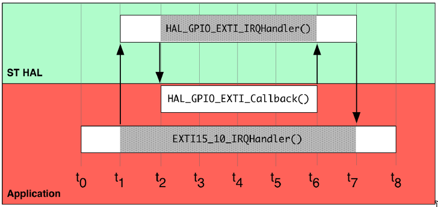
### Interrupt Lifecycle
- An interrupt can:
	1. Either be disabled or enabled by calling HAL_NVIC_EnableIRQ() or HAL_NVIC_DisableIRQ()
	2. Either be pending or not pending
	3. Either be in an active or inactive state
- When an interrupt fires it is marked as pending until the processor can serve it
- If an interrupt has a higher priority and fires while another is running, the lower priority interrupt will be suspended and the higher priority will become active again
---
## Chapter 8: UART/USART
### Overview
- A UART/USART is a device that translates a parallel sequence of bit in a continuous stream of signals flowing on a single wire
- When information flows between two devices inside a common channel, both device have to agree on timing
	- In a `synchronous transmission`, the sender and the receiver share a common clock generated by one of the two devices
- This common clock is also used to agree on when to start `sampling` the sequence of bits
- Frequency of the clock determines how fast we can transmit a single bit
- If both devices involved in data transmission agree how long it takes to transmit a single bit and when to start and finish the sample, then we don't need a dedicated clock line which gives us an `asynchronous transmission`
### Synchronous Timing Diagram
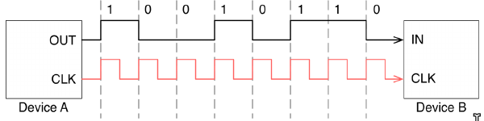
### Asynchronous Timing Diagram
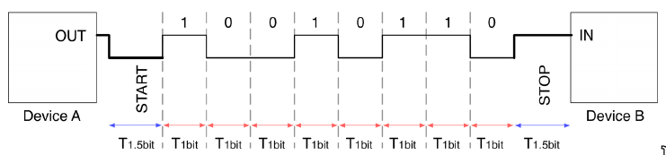
### Asynchronous Transmission Example
1. Starts with a START bit represented by the low level
	- The negative edge is detected by the receiver
2. 1.5 bit periods after, 8 data data bits are sampled
	- LSB typically transmitted first
3. An optional parity bit is then transmitted
4. Transmission ends with a STOP bit represented by a high level which lasts 1.5 bit periods
### UART vs USART
- `UART` or Universal Asynchronous Receiver/Transmitter does not use a clock signal but one TX and one RX line
- `USART` or Universal Synchronous Receiver/Transmitter adds an additional I/O as a clock line generated from the master node
### Voltage Level
- Typically will use the voltage level of the MCU I/O
- Almost always VDD but can also be referred to as TTL Voltage Levels
### Hardware Flow Control
- Some communication standards like RS232 and RS485 provide the ability to use Hardware Flow Control Lines
- A sender will set a `Request to Send` or RTS line to signal to the receiver to begin monitoring its input data line.
- When ready for data the receiver will raise its `Clear to Send` or CTS line to signal the sender to start sending data and to monitor the slave's output data line.
### UART Handle TypeDef
```c
typedef struct {
    USART_TypeDef *Instance;                 /* UART registers base address */
    UART_InitTypeDef Init;                   /* UART communication parameters */
    UART_AdvFeatureInitTypeDef AdvancedInit; /* UART Advanced Features                                                           initialization parameters */
    uint8_t *pTxBuffPtr;       /* Pointer to UART Tx transfer Buffer */
    uint16_t TxXferSize;       /* UART Tx Transfer size */
    uint16_t TxXferCount;      /* UART Tx Transfer Counter */

    uint8_t *pRxBuffPtr;       /* Pointer to UART Rx transfer Buffer */
    uint16_t RxXferSize;       /* UART Rx Transfer size */
    uint16_t RxXferCount;      /* UART Rx Transfer Counter */

    DMA_HandleTypeDef *hdmatx; /* UART Tx DMA Handle parameters */
    DMA_HandleTypeDef *hdmarx; /* UART Rx DMA Handle parameters */

    HAL_LockTypeDef Lock;                   /* Locking object */
    __IO HAL_UART_StateTypeDef gState;      /* UART communication state */
    __IO HAL_UART_ErrorTypeDef ErrorCode;   /* UART Error code */
} UART_HandleTypeDef;
```
### UART Init TypeDef
```c
typedef struct {
	uint32_t BaudRate;
	uint32_t WordLength;
	uint32_t StopBits;
	uint32_t Parity;
	uint32_t Mode;
	uint32_t HwFlowCtl;
	uint32_t OverSampling;
} UART_InitTypeDef;
```
### UART Polling Mode
- In polling mode or blocking mode, the main application synchronously waits for the data transmission and reception.
- This is the simplest form of data communication and should be used when transmit rate is not low and when its not used as a critical peripheral (output console for debug)
- Choose polling if firmware is committed to this one task
### Polling Mode Functions
```c
HAL_StatusTypeDef HAL_UART_Transmit(UART_HandleTypeDef *huart, uint8_t *pData,
                                    uint16_t Size, uint32_t Timeout);
```
huart
- pointer to an instance of the struct UART_HandleTypeDef

pData
- pointer to an array of data with the size of the Size param

Timeout
- Max time in ms to wait for transmit completion
```c
HAL_StatusTypeDef HAL_UART_Receive(UART_HandleTypeDef *huart, uint8_t *pData,
								   uint16_t Size, uint32_t Timeout);
```
huart
- pointer to an instance of the struct UART_HandleTypeDef
pData
- pointer to an array of data with the size at least equal to the Size param
Timeout
- Max time in ms to wait for receive completion
### UART Interrupt Mode
- In interrupt mode or non-blocking mode, the main application is freed from waiting for the completion of data transmission and reception.
- This mode is more suitable when the transmit rate is slower (< 38400baud) or when it happens rarely
- Choose interrupt mode if you can't use DMA but still need to free up the processor for other tasks
### Interrupt Mode Overview
1. Enable the USARTx_IRQn interrupt and implement the USARTx_IRQHandler()
2. Call HAL_UART_IRQHandler() inside the USARTx_IRQHandler()
	- This will perform all UART interrupt management
3. Use HAL_UART_Transmit_IT() and HAL_UART_Receive_IT() to exchange data over uart
	- this wat the peripheral will assert the corresponding line in the NVIC controller so that the ISR is raised when an event occurs
4. design the code to deal with asynchronous events

### UART Related Interrupts
IRQs generated during transmission
- transmission complete
- clear to send
- transmit data register empty
IRQs generated while receiving
- Idle line detection
- overrun error
- receive data register not empty
- parity error
- LIN break detection
- noise flag (multi buffer config)
- framing error (multi buffer config)
### UART polling/interrupt transmission data path
1. place a byte inside the USART->DR reg and wait until the transmit data register empty (TXE) flag is true
2. wait until the received data ready to be read (RXNE) is false and store the content of the USART->DR register inside the application memory
### So what's the difference?
- In polling, the receive and transmit functions are designed so that it waits for the corresponding event flag to be set for every byte
- In interrupt mode, the receive and transmit functions are designed so that they don't wait for data completion but loading of every byte in the DR reg or application memory is done by the ISR routine
### Interrupt Mode Functions
```c
HAL_StatusTypeDef HAL_UART_Transmit_IT(UART_HandleTypeDef *huart,
									   uint8_t *pData, uint16_t Size);
HAL_StatusTypeDef HAL_UART_Receive_IT(UART_HandleTypeDef *huart,
									  uint8_t *pData, uint16_t Size);
```
### Interrupt Example
```c
	/* Enable USART2 interrupt */
	HAL_NVIC_SetPriority(USART2_IRQn, 0, 0);
	HAL_NVIC_EnableIRQ(USART2_IRQn);

printMessage:

	printWelcomeMessage();

	while (1) {
		opt = readUserInput();
		if(opt > 0) {
			processUserInput(opt);
		if(opt == 3)
			goto printMessage;
	}
	performCriticalTasks();
	}
}

// Baseline interrupt handler which calls HAL_UART_IRQHandler
void USART2_IRQHandler(void) {
	HAL_UART_IRQHandler(&huart2);
}

// Callback function which sets the transmission flag (data to be handled)
/* Note that this function is only called when all the
   bytes specified with the size parameter are received */
void HAL_UART_RxCpltCallback(UART_HandleTypeDef *UartHandle) {
	/* Set transmission flag: transfer complete*/
	UartReady = SET; // global variable
}

// Everytime the TXE intterrupt is generated, transmits the next byte in the array
void printWelcomeMessage(void) {
	char *strings[] = {"\033[0;0H", "\033[2J", WELCOME_MSG, MAIN_MENU, PROMPT};

	for (uint8_t i = 0; i < 5; i++) {
		HAL_UART_Transmit_IT(&huart2, (uint8_t*)strings[i], strlen(strings[i]));
		// pretty much polling waiting for the last byte to sent
		while (HAL_UART_GetState(&huart2) == HAL_UART_STATE_BUSY_TX ||
		HAL_UART_GetState(&huart2) == HAL_UART_STATE_BUSY_TX_RX);
	}
}
/*
A better way to do the above transfer is to use a temporary memory aread where to store the byte sequences and let the ISR executre transfer.
utilizing something like a circ buffer, a queue, or FIFO
*/

// Checks the transmission flag and recieves the data
int8_t readUserInput(void) {
	int8_t retVal = -1;

	if(UartReady == SET) {
		UartReady = RESET;
		HAL_UART_Receive_IT(&huart2, (uint8_t*)readBuf, 1);
		retVal = atoi(readBuf);
	}

	return retVal;
}
```

### Interrupt Example Using a circ buffer
```c
/*
1. Tries to send the buffer over the UART in interrupt mode
2. If the transmit function fails (UART is busy), then the byte sequence is placed into a circ buf
3. Its then up to the HAL_UART_TxCpltCallback() to check for pending bytes in the circ buf
*/
uint8_t UART_Transmit(UART_HandleTypeDef *huart, uint8_t *pData, uint16_t len) {
	if(HAL_UART_Transmit_IT(huart, pData, len) != HAL_OK) {
		if(RingBuffer_Write(&txBuf, pData, len) != RING_BUFFER_OK)
			return 0;
	}
	return 1;
}

void HAL_UART_TxCpltCallback(UART_HandleTypeDef *huart) {
	if(RingBuffer_GetDataLength(&txBuf) > 0) {
		RingBuffer_Read(&txBuf, &txData, 1);
		HAL_UART_Transmit_IT(huart, &txData, 1);
	}
}
--------------------------------------------------------------------------
// Now we can rewrite the previous example without the busy wait

void printWelcomeMessage(void) {
	char *strings[] = {"\033[0;0H", "\033[2J", WELCOME_MSG, MAIN_MENU, PROMPT};
	for (uint8_t i = 0; i < 5; i++)
		UART_Transmit(&huart2, (uint8_t*)strings[i], strlen(strings[i]));
}


uint8_t processUserInput(uint8_t opt) {
	char msg[30];
	if(!opt || opt > 3) return 0;

	sprintf(msg, "%d", opt);
	UART_Transmit(&huart2, (uint8_t*)msg, strlen(msg));

	switch(opt) {
	case 1:
		HAL_GPIO_TogglePin(GPIOA, GPIO_PIN_5);
		break;
	case 2:
		sprintf(msg, "\r\nUSER BUTTON status: %s",
		HAL_GPIO_ReadPin(GPIOC, GPIO_PIN_13) == GPIO_PIN_RESET ? "PRESSED" : "RELEASED");
		UART_Transmit(&huart2, (uint8_t*)msg, strlen(msg));
		break;
	case 3:
		return 2;
};


UART_Transmit(&huart2, (uint8_t*)PROMPT, strlen(PROMPT));
return 1;
}
```

### RingBuffer_Read() limitations
- note that the above function RingBuffer_Read() in HAL_UART_TxCpltCallback() is not as fast as it could be consider using this function instead for time intensive applications
```c
void processPendingTXTransfers(UART_HandleTypeDef *huart) {
	if(RingBuffer_GetDataLength(&txBuf) > 0) {
	RingBuffer_Read(&txBuf, &txData, 1);
	HAL_UART_Transmit_IT(huart, &txData, 1);
	}
}
```

### My interrupt implementation
```c
// stm32fxx_it.c
void EXTI0_IRQHandler( void )
{
	HAL_GPIO_EXTI_IRQHandler( GPIO_PIN_0 );
}

void USART2_IRQHandler( void )
{
	HAL_UART_IRQHandler( &huart2 );
}

// stm32f4xx_hal_msp.c
void HAL_UART_MspInit( UART_HandleTypeDef* huart )
{
	GPIO_InitTypeDef GPIO_InitStruct = {0};
	if ( huart->Instance==USART2 )
	{
		/* Peripheral clock enable */
		__HAL_RCC_USART2_CLK_ENABLE();
		__HAL_RCC_GPIOA_CLK_ENABLE();

		/** USART2 GPIO Configuration
			PA2 ------> USART2_TX
			PA3 ------> USART2_RX
		*/
		GPIO_InitStruct.Pin = GPIO_PIN_2|GPIO_PIN_3;
		GPIO_InitStruct.Mode = GPIO_MODE_AF_PP;
		GPIO_InitStruct.Pull = GPIO_NOPULL;
		GPIO_InitStruct.Speed = GPIO_SPEED_FREQ_VERY_HIGH;
		GPIO_InitStruct.Alternate = GPIO_AF7_USART2;
		HAL_GPIO_Init(GPIOA, &GPIO_InitStruct);

		/* USART2 interrupt Init */
		HAL_NVIC_SetPriority(USART2_IRQn, 0, 0);
		HAL_NVIC_EnableIRQ(USART2_IRQn);
	}
}

void HAL_UART_MspDeInit( UART_HandleTypeDef* huart )
{
	if ( huart->Instance==USART2 )
	{
		/* Peripheral clock disable */
		__HAL_RCC_USART2_CLK_DISABLE();
		/** USART2 GPIO Configuration
			PA2 ------> USART2_TX
			PA3 ------> USART2_RX
		*/
		HAL_GPIO_DeInit(GPIOA, GPIO_PIN_2|GPIO_PIN_3);

		/* USART2 interrupt DeInit */
		HAL_NVIC_DisableIRQ(USART2_IRQn);
	}
}
// main.c

/* Includes ------------------------------------------------------------------*/
#include "main.h"
#include "ringbuffer.h"
#include <string.h>
#include <stdio.h>
#include <stdlib.h>

/* Private define ------------------------------------------------------------*/
#define PRESSED "Pressed\r\n"

/* Private variables ---------------------------------------------------------*/
UART_HandleTypeDef huart2;
uint8_t txData;
RingBuffer txBuf;

/* Private function prototypes -----------------------------------------------*/
void SystemClock_Config(void);
static void MX_GPIO_Init(void);
static void MX_USART2_UART_Init(void);

/* Private user code ---------------------------------------------------------*/
int main(void)
{
	/* MCU Configuration----------------------------------------------------- */

	/* Reset peripherals, Initializes the Flash interface and the Systick. */
	HAL_Init();

	/* Configure the system clock */
	SystemClock_Config();

	/* Initialize all configured peripherals */
	MX_GPIO_Init();
	MX_USART2_UART_Init();

	while (1){ }
}

void SystemClock_Config(void)
{
	RCC_OscInitTypeDef RCC_OscInitStruct = {0};
	RCC_ClkInitTypeDef RCC_ClkInitStruct = {0};

	/** Configure the main internal regulator output voltage */
	__HAL_RCC_PWR_CLK_ENABLE();
	__HAL_PWR_VOLTAGESCALING_CONFIG(PWR_REGULATOR_VOLTAGE_SCALE1);

	/** Initializes the RCC Oscillators according to the specified parameters
	*   in the RCC_OscInitTypeDef structure.
	*/
	RCC_OscInitStruct.OscillatorType = RCC_OSCILLATORTYPE_HSI;
	RCC_OscInitStruct.HSIState = RCC_HSI_ON;
	RCC_OscInitStruct.HSICalibrationValue = RCC_HSICALIBRATION_DEFAULT;
	RCC_OscInitStruct.PLL.PLLState = RCC_PLL_ON;
	RCC_OscInitStruct.PLL.PLLSource = RCC_PLLSOURCE_HSI;
	RCC_OscInitStruct.PLL.PLLM = 8;
	RCC_OscInitStruct.PLL.PLLN = 100;
	RCC_OscInitStruct.PLL.PLLP = RCC_PLLP_DIV2;
	RCC_OscInitStruct.PLL.PLLQ = 4;

	if ( HAL_RCC_OscConfig(&RCC_OscInitStruct) != HAL_OK )
	{
		Error_Handler();
	}

	/** Initializes the CPU, AHB and APB buses clocks*/
	RCC_ClkInitStruct.ClockType = RCC_CLOCKTYPE_HCLK|RCC_CLOCKTYPE_SYSCLK
	|RCC_CLOCKTYPE_PCLK1|RCC_CLOCKTYPE_PCLK2;
	RCC_ClkInitStruct.SYSCLKSource = RCC_SYSCLKSOURCE_PLLCLK;
	RCC_ClkInitStruct.AHBCLKDivider = RCC_SYSCLK_DIV1;
	RCC_ClkInitStruct.APB1CLKDivider = RCC_HCLK_DIV2;
	RCC_ClkInitStruct.APB2CLKDivider = RCC_HCLK_DIV1;

	if ( HAL_RCC_ClockConfig( &RCC_ClkInitStruct, FLASH_LATENCY_3 ) != HAL_OK )
	{
		Error_Handler();
	}
}

static void MX_USART2_UART_Init(void)
{
	huart2.Instance = USART2;
	huart2.Init.BaudRate = 115200;
	huart2.Init.WordLength = UART_WORDLENGTH_8B;
	huart2.Init.StopBits = UART_STOPBITS_1;
	huart2.Init.Parity = UART_PARITY_NONE;
	huart2.Init.Mode = UART_MODE_TX_RX;
	huart2.Init.HwFlowCtl = UART_HWCONTROL_NONE;
	huart2.Init.OverSampling = UART_OVERSAMPLING_16;
	if ( HAL_UART_Init( &huart2 ) != HAL_OK )
	{
		Error_Handler();
	}
}

static void MX_GPIO_Init(void)
{
	GPIO_InitTypeDef GPIO_InitStruct = {0};
	__HAL_RCC_GPIOA_CLK_ENABLE();

	/*Configure GPIO pin : PA0 */
	GPIO_InitStruct.Pin = GPIO_PIN_0;
	GPIO_InitStruct.Mode = GPIO_MODE_IT_FALLING;
	GPIO_InitStruct.Pull = GPIO_PULLUP;
	HAL_GPIO_Init(GPIOA, &GPIO_InitStruct);

	/* EXTI interrupt init*/
	HAL_NVIC_SetPriority(EXTI0_IRQn, 0, 0);
	HAL_NVIC_EnableIRQ(EXTI0_IRQn);
}


/* USER CODE BEGIN 4 */
// If theres data in the circ buf, handle it
void HAL_UART_TxCpltCallback( UART_HandleTypeDef* huart )
{
	if ( RingBuffer_GetDataLength( &txBuf ) > 0 )
	{
		RingBuffer_Read( &txBuf, &txData, 1 );
		HAL_UART_Transmit_IT( huart, &txData, 1 );
	}
}

// Attempt UART interrupt transmission, if not avail push message to circbuf
uint8_t UART_Transmit( UART_HandleTypeDef* huart, uint8_t* pData, uint16_t len )
{
	if ( HAL_UART_Transmit_IT( huart, pData, len ) != HAL_OK )
	{
		if ( RingBuffer_Write( &txBuf, pData, len ) != RING_BUFFER_OK )
		{
			return 0;
		}
	}
	return 1;
}

// When button interrupt is hit, send UART message
void HAL_GPIO_EXTI_Callback( uint16_t GPIO_Pin )
{
	// Not really necessary since I have only 1 EXTI GPIO
	if ( GPIO_Pin == GPIO_PIN_0 )
	{
		// Transmit a message
		UART_Transmit( &huart2, (uint8_t*)PRESSED, strlen(PRESSED) );
	}
}
/* USER CODE END 4 */
```
### UART DMA Mode
- In DMA mode, the data transmission throughput is high due to the direct connection of the UART peripheral to the MCU internal RAM
---
## Chapter 9: DMA
### DMA Overview
- Transferring data between the internal SRAM or flash memory and the peripheral registers requires a cetain number of CPU cycles to accomplish the transfer which in turn leads to a loss of computing power
- The `Direct Memory Access` (DMA) controller is a dedicated and programmable hardware unit that allows MCU peripherals access to internal memoryies without the intervention of the Cortex-M core.
- DMA can work in both ways by sending and receiving data
- Some portions of the internal SRAM memory is used as a temporary area of storage for different peripherals
### Typical Peripheral to Memory Example
```c
uint8_t buf[20];
HAL_UART_Receive( &huart2, buf, 20, HAL_MAX_DELAY );
```
- This will read 20 bytes from the UART2 interface
- We allocate an array in the SRAM of the same size
- The HAL_UART_Receive function will access huart2.Instance->DR 20 times to transfer bytes to internal memory + it will poll the RXNE flag to detect when new data is ready
- This has a lot of CPU overhead
### DMA Prereq

- Both the core and the DMA controller interact with the MCU peripherals and memory through buses
- Both the core and the DMA controller are masters .i.e. they are the only units that can start a transaction on a bus
- The core and the controller cannot access the same slave peripheral at the same time
	- The bus matrix manages this through a *Round Robin* algotrithm

### DMA HandleTypeDef (F4)
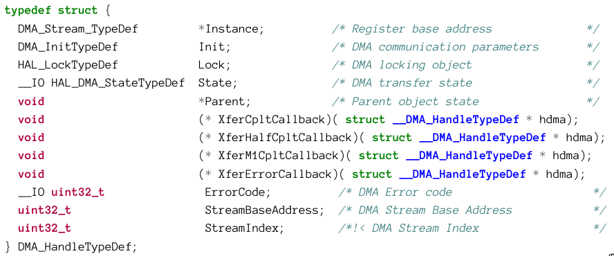
Instance
- pointer to the stream descriptor

Init
- instance of DMA_InitTypeDef used to configure

Parent
- used by the HAL to keep track of the peripheral handlers
- would point to UART_HandleTypeDef if we were using UART
### DMA_InitTypeDef (F4)
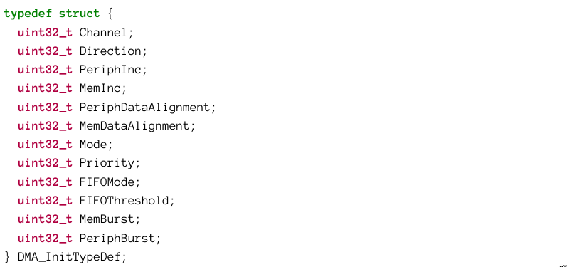

### DMA in polling mode example
```c
UART_HandleTypeDef huart2;
DMA_HandleTypeDef hdma_usart2_tx;
char msg[] = "hello\r\n";

int main(void)
{
	/* Reset peripherals, Initializes the Flash interface and the Systick. */
	HAL_Init();

	/* Configure the system clock */
	SystemClock_Config();

	/* Initialize all configured peripherals */
	MX_GPIO_Init();
	MX_USART2_UART_Init();
	MX_DMA_Init();

	/* USART2 DMA Init */
	/* USART2_TX Init */
	hdma_usart2_tx.Instance = DMA1_Stream6;
	hdma_usart2_tx.Init.Channel = DMA_CHANNEL_4;
	hdma_usart2_tx.Init.Direction = DMA_MEMORY_TO_PERIPH;
	hdma_usart2_tx.Init.PeriphInc = DMA_PINC_DISABLE;
	hdma_usart2_tx.Init.MemInc = DMA_MINC_ENABLE;
	hdma_usart2_tx.Init.PeriphDataAlignment = DMA_PDATAALIGN_BYTE;
	hdma_usart2_tx.Init.MemDataAlignment = DMA_MDATAALIGN_BYTE;
	hdma_usart2_tx.Init.Mode = DMA_NORMAL;
	hdma_usart2_tx.Init.Priority = DMA_PRIORITY_LOW;
	hdma_usart2_tx.Init.FIFOMode = DMA_FIFOMODE_DISABLE;
	HAL_DMA_Init(&hdma_usart2_tx);

	HAL_DMA_Start(&hdma_usart2_tx,(uint32_t)msg,(uint32_t)&huart2.Instance->TDR,                   strlen(msg));

	//Enable UART in DMA mode
	huart2.Instance->CR3 |= USART_CR3_DMAT;

	//Wait for transfer complete
	HAL_DMA_PollForTransfer(&hdma_usart2_tx, HAL_DMA_FULL_TRANSFER,                                          HAL_MAX_DELAY);
	//Disable UART DMA mode
	huart2.Instance->CR3 &= ~USART_CR3_DMAT;

	//Turn LD2 ON
	HAL_GPIO_WritePin(LD2_GPIO_Port, LD2_Pin, GPIO_PIN_SET);
}
```
- Remember that almost every STM32 internal module must be enabled by using the \
- \__HAL_RCC\<PERIPHERAL>_CLK_ENABLE() macro
- This code is dumb and meaningless since it waits for the DMA transfer
### DMA in interrupt mode example
```c
...
	hdma_usart2_tx.Instance = DMA1_Stream6;
	hdma_usart2_tx.Init.Channel = DMA_CHANNEL_4;
	hdma_usart2_tx.Init.Direction = DMA_MEMORY_TO_PERIPH;
	hdma_usart2_tx.Init.PeriphInc = DMA_PINC_DISABLE;
	hdma_usart2_tx.Init.MemInc = DMA_MINC_ENABLE;
	hdma_usart2_tx.Init.PeriphDataAlignment = DMA_PDATAALIGN_BYTE;
	hdma_usart2_tx.Init.MemDataAlignment = DMA_MDATAALIGN_BYTE;
	hdma_usart2_tx.Init.Mode = DMA_NORMAL;
	hdma_usart2_tx.Init.Priority = DMA_PRIORITY_LOW;
	hdma_usart2_tx.XferCpltCallback = &DMATransferComplete;
	HAL_DMA_Init(&hdma_usart2_tx);

	HAL_NVIC_SetPriority(DMA1_Channel4_5_IRQn, 0, 0);
	HAL_NVIC_EnableIRQ( DMA1_Channel4_5_IRQn );

	HAL_DMA_Start_IT(&hdma_usart2_tx,(uint32_t)msg,(uint32_t)&huart2.Instance-                        >TDR, strlen(msg));

	//Enable UART in DMA mode
	huart2.Instance->CR3 |= USART_CR3_DMAT;

	while(1);
}

void DMATransferComplete( DMA_HandleTypeDef *hdma )
{
	if (hdma->Instance == DMA1_Channel4 )
	{
		// disable UART DMA mode
		huart2.Instance->CR3 &= ~USART_CR3_DMAT;
		// Turn on LED
		HAL_GPIO_WritePin( LD2_GPIO_PORT, LD2_Pin, GPIO_PIN_SET );
	}
}
```

### See parts on UART receive and mem to mem transfer

---
## Chapter 10: Clock Tree

### Overview
- `clock` is a device that generates periodic signals
- the ability to selectively disable or reduce the clock speed of some MCU parts allows the developer to optimize power consumption.
### Measuring Clocks/Periodic Signals
- `duty cycle` is time the signal is high
- `frequency` is the # of complete cycles of a periodic signal per second measured in Hz
- `period` is the duration of 1 complete cycle of a periodic signal

`$\text{Duty Cycle} (\%) = \left( \frac{\text{Time Active}}{\text{Total Period}} \right) \times 100$`

`$\text{Period} = \frac{1}{\text{Frequency}}$`

- If a PWM signal with a period of 10ms is high for 4ms the duty cycle is
`$\text{Duty Cycle} = \left( \frac{4 \text{ ms}}{10 \text{ ms}} \right) \times 100 = 40\%$`

- A $\micro$C outputs a PWM signal with a freq of 1 kHz. The period is
`$\text{Period} = \frac{1}{1000 \text{ Hz}} = 0.001 \text{ s} = 1 \text{ ms}$`
- and at 50% duty cycle the signal will be high for `$0.5\text{ ms}$`
### Clock Distribution
- usually the clock will generate a square wave signal with a 50% duty cycle
- STM32s can be clocked by a high-speed `internal RC oscillator` or and `external crystal`
- External crystals offer higher precision and some peripherals, especially high-speed, can only be clocked by an external dedicated crystal
- A low speed internal or external oscillator is used to drive the RTC and Independent Watchdog.
- *The frequency of the high-speed oscillator does not establish the acutal freq of the cortex-M or the peripherals*
- A complex distribution network, called a `clock tree`, is responsible for the propagation of the clock signal inside.
	- Using Phase-locked loops (increase) and prescalers (decrease), its possible to increase/decrease the source frequency at needs
### Clock Tree Configuration
- Configuration is done through a dedicated peripheral, `Reset and Clock Control (RCC)`
1. High-speed oscillator source is selected and configured if external (HSE) is used
2. If we want SYSCLK to have a higher frequency $\to$ configure the main PLL
3. Configure the System Clock Switch (SW) by:
	1. Choosing the right clock source
	2. Prescaler settings for the Advanced Peripheral Bus(es) (APB) and Advanced High-Performance Bus(es) (AHB)
---
## Chapter 11:


---
## Chapter 12:


---
## Chapter 13:


---
## Chapter 14:


---

# References